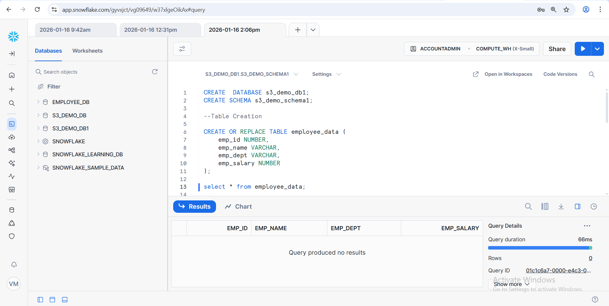
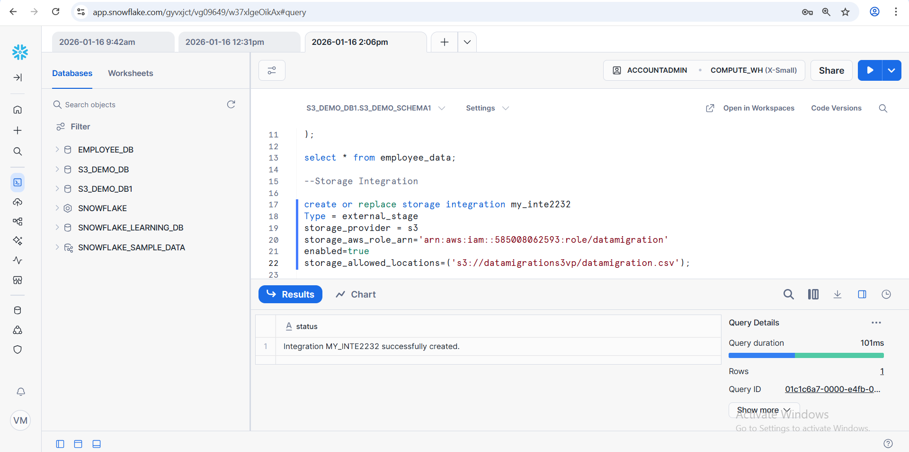
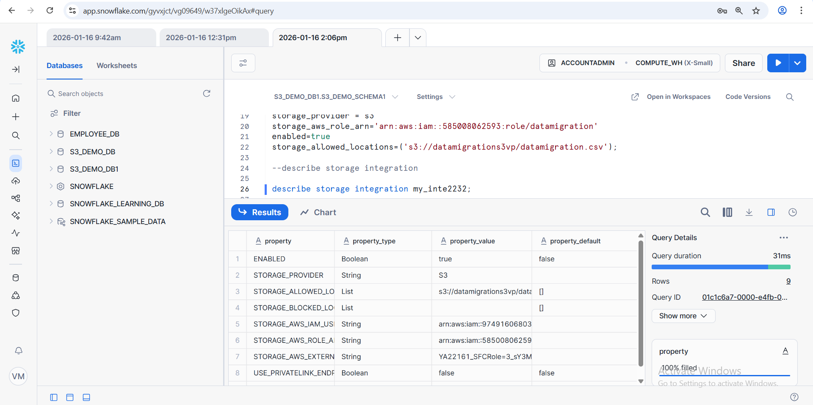
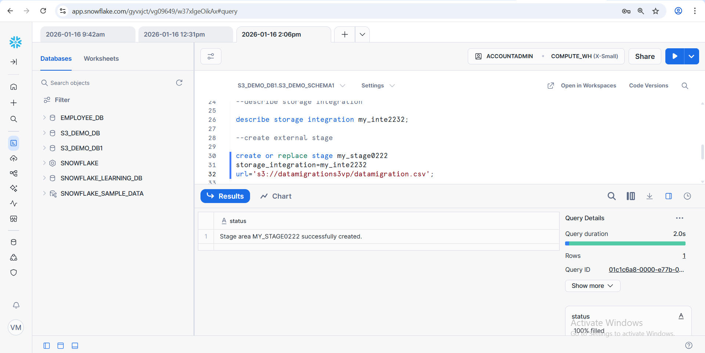
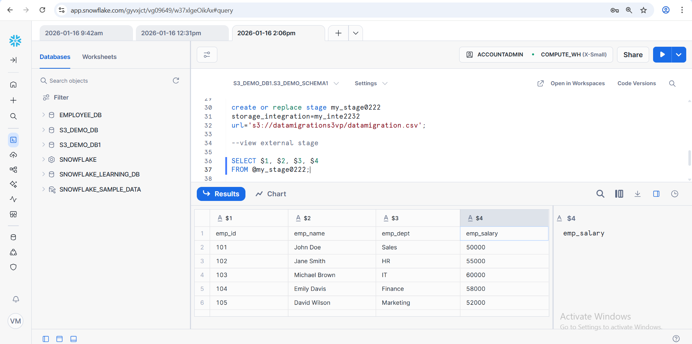
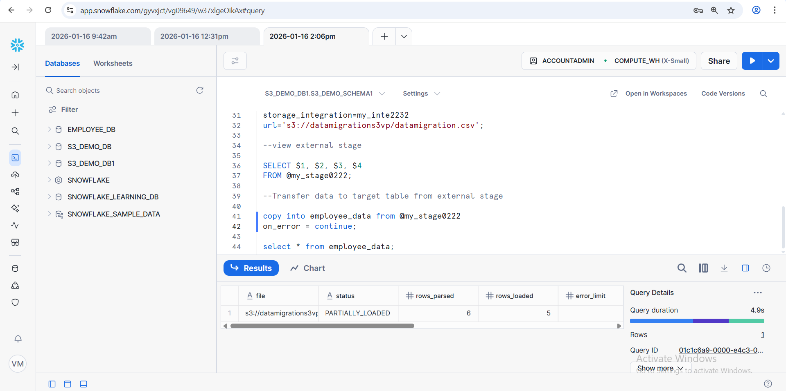
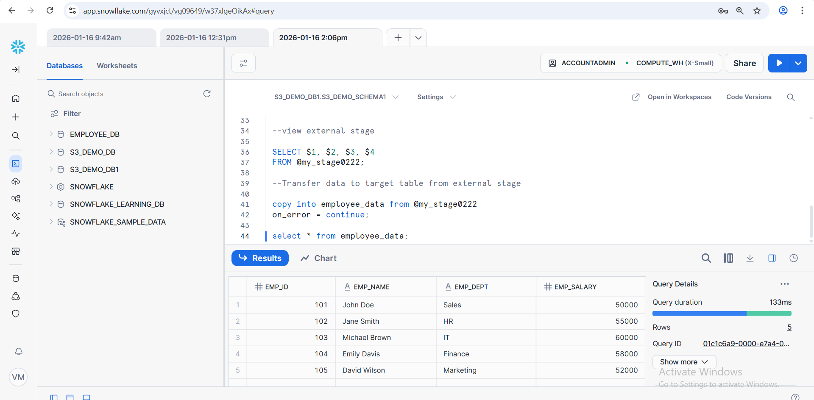

# Snowflake + Amazon S3 Data Integration Project

This project demonstrates how to integrate **Amazon S3 with Snowflake** using
**Storage Integration and External Stages** to load data into Snowflake tables.

---

## 🚀 Technologies Used
- Snowflake
- Amazon S3
- AWS IAM Role
- SQL
- GitHub

---

## 📌 Project Workflow

1. Create Snowflake Database and Schema
2. Create Target Table
3. Configure Storage Integration with Amazon S3
4. Create External Stage
5. Load Data from S3 into Snowflake
6. Validate and Query Data

---

## 📂 Folder Structure

```

snowflake-s3-project/
├── 01_create_database_schema.sql
├── 02_create_table.sql
├── 03_storage_integration.sql
├── 04_external_stage.sql
├── 05_load_data.sql
└── README.md

```

### Create Database & Schema


CREATE DATABASE s3_demo_db1;
CREATE SCHEMA s3_demo_schema1;


--Table Creation

CREATE OR REPLACE TABLE employee_data (
    emp_id NUMBER,
    emp_name VARCHAR,
    emp_dept VARCHAR,
    emp_salary NUMBER
);

select * from employee_date;

📸 Table Created in Snowflake  


--Storage Integration

create storage integration my_inte2232
Type = external_stage
storage_provider = s3
storage_aws_role_arn='arn:aws:iam::585008062593:role/datamigration'
enabled=true
storage_allowed_locations=('s3://datamigrations3vp/datamigration.csv');

📸 Storage Integration


--describe storage integration

describe storage integration my_inte2232;

📸 Describe Storage Integration



--create external stage

create stage my_stage0222
storage_integration=my_inte2232
url='s3://datamigrations3vp/datamigration.csv';

📸 External Stage


--view external stage

SELECT $1, $2, $3, $4 
FROM @my_stage0222;

📸 View External Stage



--Transfer data to target table from external stage

copy into employee_data from @my_stage0222
on_error = continue;

select * from employee_data;

📸 Load_data



📸 Data successfully loaded from Amazon S3 into Snowflake



✅ Output

Data successfully loaded from Amazon S3 into Snowflake

Data validated using SQL queries


